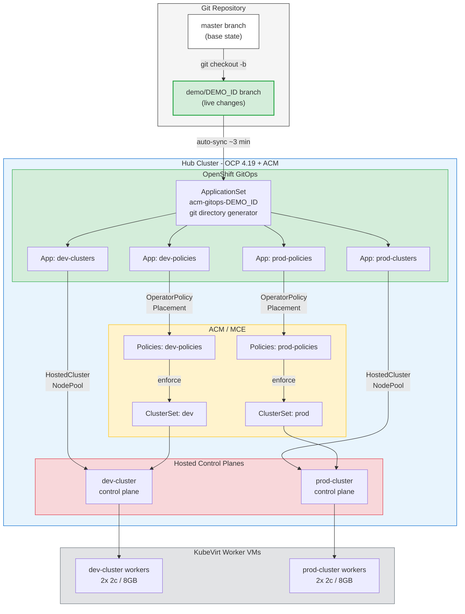
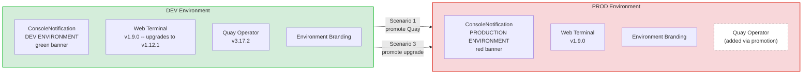
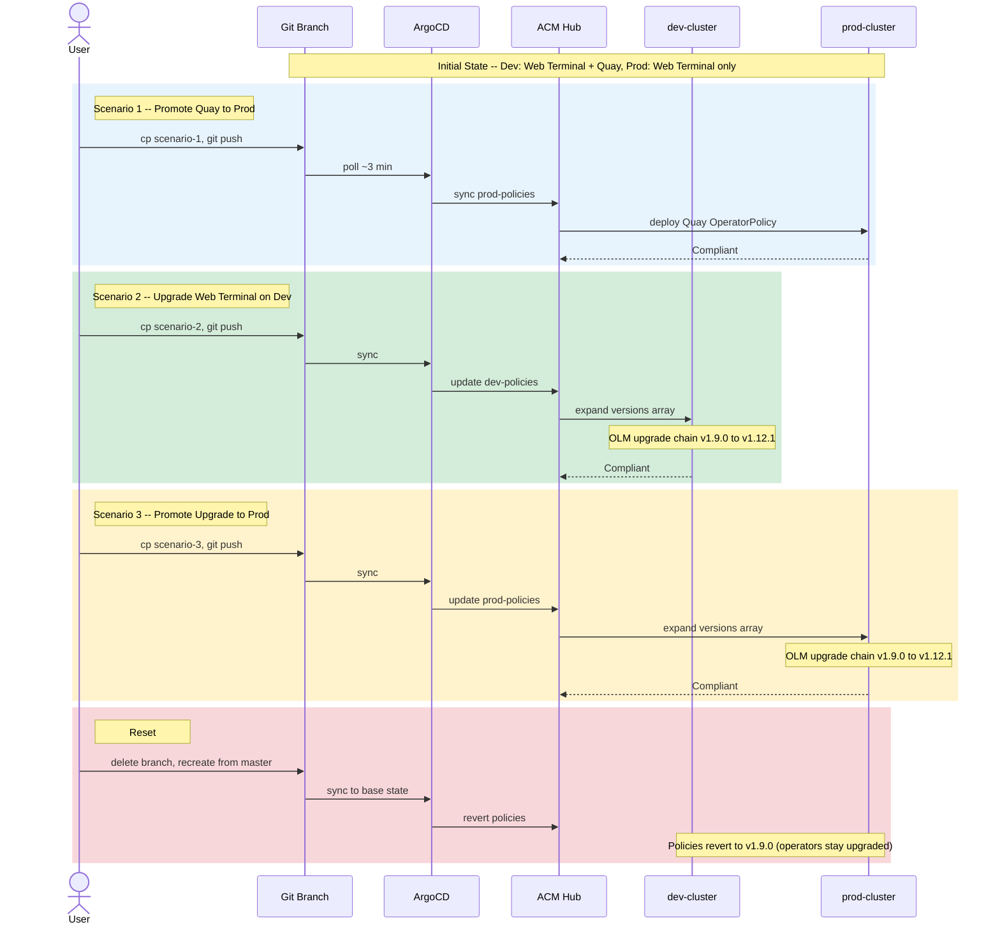
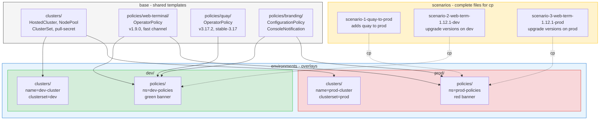
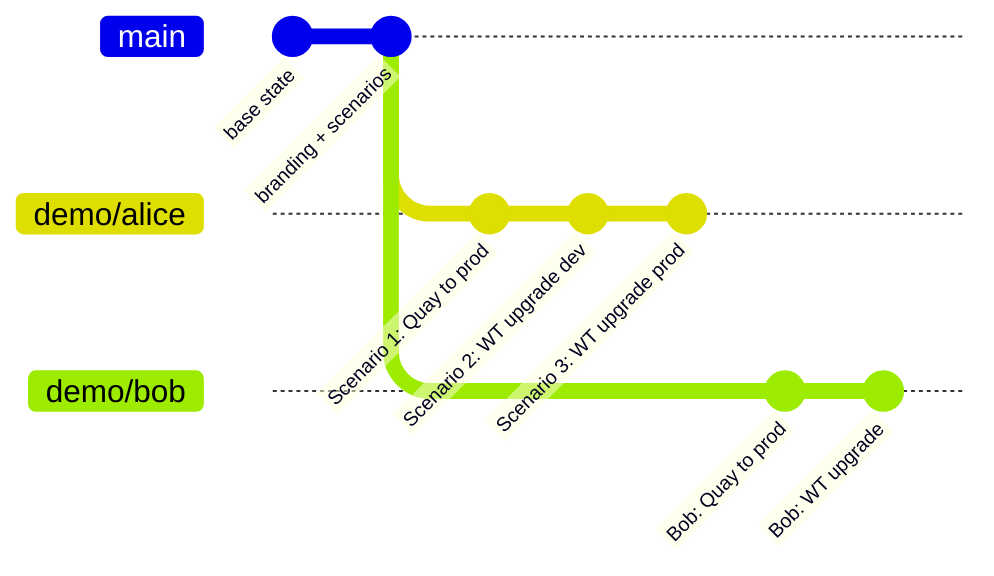

# Demo Diagrams

Mermaid diagrams for the ACM GitOps demo. These render on GitHub and can be imported into draw.io (Extras > Edit Diagram > paste mermaid), Miro, or any Mermaid-compatible tool.

## 1. GitOps Architecture

## 2. Environment Comparison

## 3. Promotion Flow

## 4. Kustomize Overlay Structure

## 5. Branch Strategy

Multiple users work on independent branches. Each branch has its own ApplicationSet and ArgoCD Applications. Reset = delete branch, recreate from master.
