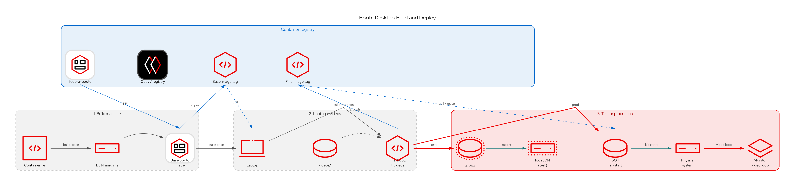

# Fedora bootc desktop

Fedora 44 GNOME desktop built from a bootc container. After graphical login the session plays every file in `videos/` fullscreen, in a loop.

Artifacts:

- an Anaconda ISO whose first boot runs an unattended kickstart (wipe the first disk, install, reboot)
- a qcow2 disk for libvirt on this machine

## Overview



## Prerequisites

- podman
- root, for `podman build` and `bootc-image-builder` (they share `/var/lib/containers/storage`)
- libvirt, `virt-install`, and OVMF (`edk2-ovmf`) to test the qcow2

## 1. Build the base image

The base image has GNOME, GDM autologin as `kiosk`, the video-loop service, and an empty `/usr/local/share/videos`. It does not include media files.

```bash
./scripts/build-base.sh
# optional custom tag:
# ./scripts/build-base.sh registry.example.com/fedora-desktop-bootc-base:1.0
```

Default tag is `localhost/fedora-desktop-bootc-base:latest`.

## 2. Add videos and build an ISO or qcow2

Put media into `videos/` (mp4, mkv, webm, mov, avi, or m4v). Files there are gitignored.

```bash
# example: one clip
cp /path/to/openshift_virtualization.mp4 videos/

# or several
cp /path/to/clips/*.mp4 videos/
```

Then build the final container (base + videos) and one disk artifact:

```bash
./scripts/build-images.sh qcow2   # -> output/qcow2/disk.qcow2
./scripts/build-images.sh iso     # -> output/iso/install.iso

# custom tags and artifact path:
./scripts/build-images.sh qcow2 \
  --base registry.example.com/fedora-desktop-bootc-base:1.0 \
  --name registry.example.com/fedora-desktop-bootc:1.0 \
  --output ./demo-desktop.qcow2
```

`build-images.sh` fails if the base image is missing or if `videos/` has no media. Defaults: `--base` `localhost/fedora-desktop-bootc-base:latest`, `--name` `localhost/fedora-desktop-bootc:latest`, `--output` `output/qcow2/disk.qcow2` or `output/iso/install.iso` (or `BASE_IMAGE` / `FINAL_IMAGE` / `OUTPUT` if set). The image builder cannot emit an ISO and a qcow2 in one request, so choose one type per run. Kickstart config is applied only to the ISO.

Manual equivalent of the final image step:

```bash
sudo podman build \
  -t localhost/fedora-desktop-bootc:latest \
  -f Containerfile.videos \
  --ignorefile .containerignore.videos \
  --build-arg BASE_IMAGE=localhost/fedora-desktop-bootc-base:latest \
  .
```

The ISO kickstart is Czech (`cs_CZ`, keyboard `cz`, `Europe/Prague`), uses DHCP, and erases the first disk. Boot it only on a disk you can wipe.

## Libvirt

```bash
./scripts/run-libvirt.sh        # boot the preinstalled qcow2
./scripts/run-libvirt.sh iso    # install from the ISO with the embedded kickstart
```

`qcow2` starts VM `fedora-desktop-bootc` from `output/qcow2/disk.qcow2` (4 vCPU, 4 GiB RAM, UEFI, SPICE).

`iso` starts a second VM, `fedora-desktop-bootc-install`. It boots `output/iso/install.iso` and installs onto a new 20 GiB disk at `output/install/disk.qcow2`. GRUB on the ISO waits 5 seconds, then the kickstart erases that virtual disk, installs, ejects the ISO, and reboots into the desktop. The install does not touch the host disk or the prebuilt qcow2.

GDM logs in as `kiosk` (password `kiosk`) and starts the video loop. Closing mpv starts it again after one second.
