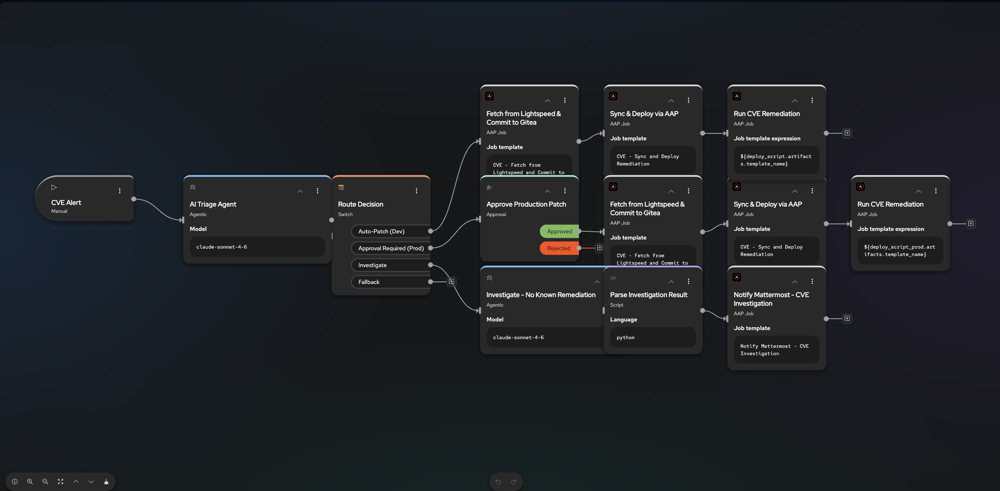

# RHEL CVE Remediation (Automation Orchestrator)

Demo of intelligent CVE remediation using Ansible Automation Platform + Automation Orchestrator + Red Hat Lightspeed MCP.

Upstream source: [ansible-tmm/aap-orchestrator-demos/cve-remediation](https://github.com/ansible-tmm/aap-orchestrator-demos/tree/main/cve-remediation)



## What it does

When a CVE alert arrives, an AO workflow:

1. Queries Red Hat Lightspeed for errata availability on the target host
2. Reads host `env` from AAP inventory (`dev` vs `production`)
3. Routes to one of three paths:
   - **auto_patch** — dev + errata available: fetch Lightspeed playbook → Gitea → AAP sync/run
   - **approved_patch** — production + errata: same, but pause for human approval in AO
   - **investigate** — no errata: second agent builds a risk report → Mattermost

See [workflow.mermaid](workflow.mermaid) for the flow diagram.

## This directory

| Path | Purpose |
|------|---------|
| `DEPLOY.md` | Step-by-step deploy against your workshop cluster |
| [Manual UI checklist](../.cursor/skills/cve-remediation-demo/MANUAL-CHECKLIST.md) | AO + Insights steps the agent cannot do |
| `docs/ENV.md` | How to create `.env` from `.env.example` (gitignored) |
| `docs/GITEA.md` | What Gitea / `lab-user/lightspeed_playbooks` / PAT mean |
| `docs/MATTERMOST.md` | Mattermost on OCP (AAP JT) or RHEL+Podman |
| `docs/AAP-TEMPLATES.md` | Reused Product Demos templates + CVE workflow |
| `GAP-ANALYSIS.md` | What is already present vs still missing |
| `CLAUDE.md` | Agent context for future work |
| `.env.example` | Dummy secrets template → copy to `.env` |
| `aap/playbooks/` | AAP playbooks (CVE helpers + OCP/RHEL Mattermost/Gitea) |
| `ao/` | AO workflow JSON (import after MCP + AAP setup) |
| `setup/` | MCP VM setup script (alternative to OpenShift deploy) |
| `ocp/` | OpenShift manifests for MCP servers |
| `docs/UPSTREAM-REQUIREMENTS.md` | Upstream requirements (reference) |

## Quick start

```bash
cd demo-cve-remediation
cp .env.example .env    # gitignored — see docs/ENV.md
# edit .env: Lightspeed, liteLLM (AO_MODEL_*), Gitea PAT, Mattermost token, etc.
```

1. **[docs/ENV.md](docs/ENV.md)** — create `.env` from `.env.example`
2. **[docs/GITEA.md](docs/GITEA.md)** — what `lab-user/lightspeed_playbooks` + PAT mean
3. **[docs/AAP-TEMPLATES.md](docs/AAP-TEMPLATES.md)** — AWS reuse + workflow
4. **[docs/MATTERMOST.md](docs/MATTERMOST.md)** — Mattermost on OCP via AAP
5. **[DEPLOY.md](DEPLOY.md)** / **[STATUS.md](STATUS.md)** — full deploy + live status

Do not import the AO workflow until MCP integrations and credentials from `.env` are configured.
